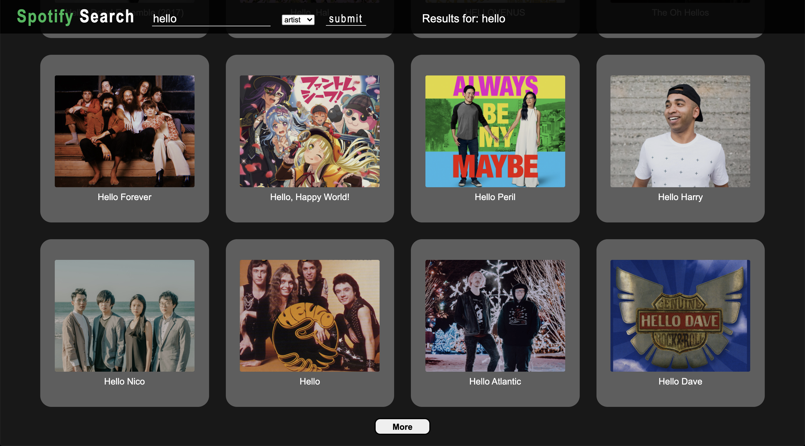
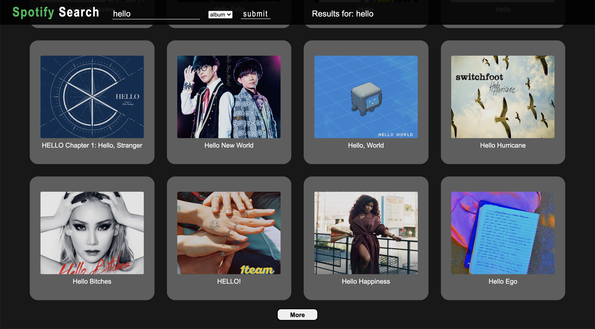

# Spotify Search API

Search spotify's database to find albums or artists
(note: searches can take up to 10 seconds)

## Features

-   Search by album or artist
    -   shows album/artist name and cover art
    -   shows 20 results at a time
-   Clicking on a search results redirects the user to the artsits/album's corresponding spotify page
-   Infinite scroll (to activate, enter "?scroll=infinitely" at the end of the url, then submit a search)

## Tech Stack

-   JavaScript
    -   jQuery
    -   Node.js
-   Ajax
-   Handlebars
-   Spotify API
-   HTML
-   CSS

## Screenshots

### Search Bar

### Artist Search

### Album Search

